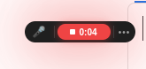
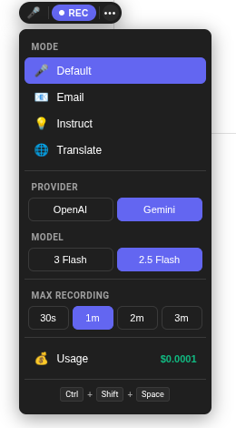
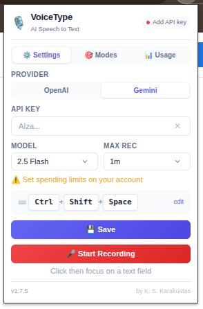
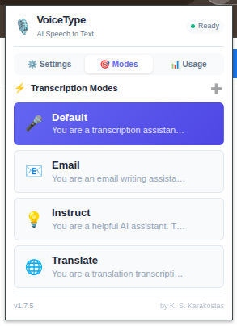
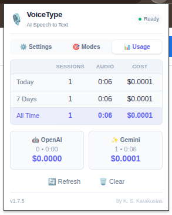

<p align="center">
  
</p>

<h1 align="center">VoiceType</h1>

<p align="center">
  <strong>🎙️ AI-Powered Speech to Text for Chrome</strong>
</p>

<p align="center">
  Transform your voice into text anywhere on the web.<br>
  Just speak — let AI do the typing.
</p>

<p align="center">
  
  
  
</p>

---

<p align="center">
  
</p>

<p align="center"><em>Compact, unobtrusive interface that appears next to any text field</em></p>

---

## ✨ Features

<table>
<tr>
<td width="50%">

### 🎤 Voice to Text
Speak naturally into any text field on any website. VoiceType uses AI to accurately transcribe your speech with proper punctuation.

### 🤖 Multi-Provider Support  
Choose between **OpenAI** (GPT-4o) or **Google Gemini** — use whichever fits your needs and budget.

### 📧 Smart Modes
Not just transcription — compose emails, translate languages, or ask AI questions directly with your voice.

</td>
<td width="50%">

### ⌨️ Keyboard Shortcuts
Start and stop recording without touching your mouse. Customizable hotkey support.

### 📊 Usage Tracking
Monitor your sessions, audio time, and estimated costs. Never get surprised by your bill.

### 🔒 Privacy First
Your API key stays encrypted on your device. Audio goes directly to your chosen provider — we never see it.

</td>
</tr>
</table>

---

## 📸 Screenshots

<table>
<tr>
<td align="center" width="50%">
<br>
<strong>Quick Settings</strong><br>
<em>Change modes, provider, and model without leaving the page</em>
</td>
<td align="center" width="50%">
<br>
<strong>Settings Panel</strong><br>
<em>Configure your API keys and preferences</em>
</td>
</tr>
<tr>
<td align="center" width="50%">
<br>
<strong>Transcription Modes</strong><br>
<em>Choose how AI processes your speech</em>
</td>
<td align="center" width="50%">
<br>
<strong>Usage Statistics</strong><br>
<em>Track sessions, time, and costs by provider</em>
</td>
</tr>
</table>

---

## 🎯 Modes Explained

| Mode | Icon | What it does |
|------|:----:|--------------|
| **Default** | 🎤 | Accurate speech-to-text transcription |
| **Email** | 📧 | Transforms your ideas into formatted emails |
| **Instruct** | 💡 | Ask AI questions, get responses in the text field |
| **Translate** | 🌐 | Speak in any language, get text in another |

---

## 🚀 Quick Start

### 1. Install the Extension

```bash
# Clone the repository
git clone https://github.com/kskarakostas/voicetype.git

# Or download ZIP and extract
```

Then in Chrome:
1. Go to `chrome://extensions/`
2. Enable **Developer mode** (top right)
3. Click **Load unpacked**
4. Select the extension folder

### 2. Get an API Key

**Option A: OpenAI** (Best accuracy)
- Go to [platform.openai.com](https://platform.openai.com)
- Create an API key
- Cost: ~$0.006/minute

**Option B: Google Gemini** (Free tier available)
- Go to [aistudio.google.com](https://aistudio.google.com)
- Create an API key
- Cost: Free tier, then pay-per-use

### 3. Configure & Go

1. Click the VoiceType icon in Chrome
2. Paste your API key
3. Click **Save**
4. Click into any text field and start talking!

---

## ⌨️ Keyboard Shortcut

> **Important:** You must set this up manually in Chrome.

1. Go to `chrome://extensions/shortcuts`
2. Find **VoiceType**
3. Click the pencil icon ✏️
4. Press your preferred shortcut (e.g., `Ctrl+Shift+Space`)
5. Done!

---

## ❓ FAQ

<details>
<summary><b>Is VoiceType free?</b></summary>
<br>
The extension is free. You need an API key from OpenAI (pay-per-use) or Google Gemini (has free tier).
</details>

<details>
<summary><b>Which provider should I use?</b></summary>
<br>
<b>OpenAI gpt-4o:</b> Best accuracy, especially for accents<br>
<b>OpenAI gpt-4o-mini:</b> Good accuracy, half the cost<br>
<b>Google Gemini:</b> Good accuracy, has free tier
</details>

<details>
<summary><b>Why doesn't the shortcut work?</b></summary>
<br>
Chrome requires you to manually set keyboard shortcuts at <code>chrome://extensions/shortcuts</code>
</details>

<details>
<summary><b>Why are short recordings ignored?</b></summary>
<br>
Recordings under 3 seconds are treated as accidental clicks to save you money.
</details>

<details>
<summary><b>Does it work offline?</b></summary>
<br>
No. Audio must be sent to OpenAI or Google for AI processing.
</details>

---

## 🔧 Troubleshooting

| Problem | Solution |
|---------|----------|
| **"Add API key" error** | Click the extension icon → paste your API key → Save |
| **Microphone not working** | Click the 🔒 in address bar → Allow microphone |
| **Shortcut doesn't work** | Set it manually at `chrome://extensions/shortcuts` |
| **Transcription fails** | Check your API key and account balance |
| **Poor quality** | Speak clearly, reduce background noise, try gpt-4o |

---

## 💰 Pricing Estimate

| Provider | Model | Cost per Minute |
|----------|-------|-----------------|
| OpenAI | gpt-4o | ~$0.006 |
| OpenAI | gpt-4o-mini | ~$0.003 |
| Gemini | 2.5 Flash | Free tier available |

*A typical 30-second recording costs less than $0.01*

---

## 🔒 Privacy

- ✅ API keys encrypted locally in your browser
- ✅ Audio sent directly to OpenAI/Google (not our servers)
- ✅ No analytics or tracking
- ✅ Fully open source

---

## 📄 License

MIT License — use it, modify it, share it.

---

## 👨‍💻 Author

**K. S. Karakostas**

---

<p align="center">
  <strong>⭐ Star this repo if you find it useful!</strong>
</p>

<p align="center">
  <a href="https://github.com/kskarakostas/voicetype/issues">Report Bug</a>
  ·
  <a href="https://github.com/kskarakostas/voicetype/issues">Request Feature</a>
</p>
