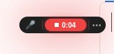
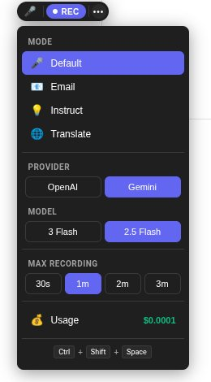
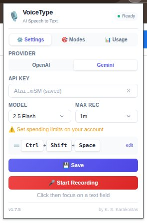
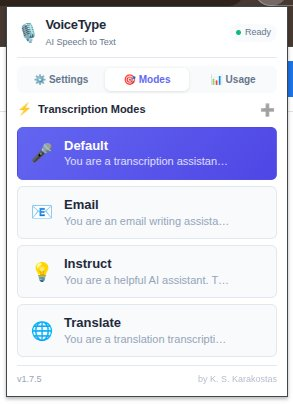
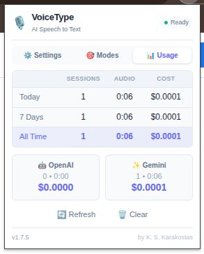

<p align="center">
  
</p>

<h1 align="center">VoiceType</h1>

<p align="center">
  <strong>BYOK dictation for Chrome with cost transparency</strong>
</p>

<p align="center">
  Transform your voice into text anywhere on the web.<br>
  Just speak. Let AI do the typing.
</p>

<p align="center">
  
  
  
</p>

---

<p align="center">
  
</p>

<p align="center"><em>Compact, unobtrusive interface that appears next to any text field</em></p>

---

## ✨ Features

<table>
<tr>
<td width="50%">

### 🎤 Voice to Text
Speak naturally into any text field on any website. VoiceType uses AI to accurately transcribe your speech with proper punctuation.

### 🤖 Multi-Provider Support  
Bring your own OpenAI or Gemini key. Speech recognition uses `gpt-transcribe` or `gemini-3.5-transcribe`; modes such as Email run the transcript through `gpt-6-luna` or `gemini-3.8-flash`.

### 📧 Smart Modes
Not just transcription: compose emails, translate languages, or ask AI questions directly with your voice.

</td>
<td width="50%">

### ⌨️ Hold to Talk
Hold the hotkey while you speak and let go to insert, or tap to start and tap again to stop. Works in iframes and fields in open shadow roots too.

### 📊 Usage Tracking
Monitor your sessions, audio time, and estimated costs. Never get surprised by your bill.

### 🔒 Privacy First
Keys stay in your browser's local extension storage, readable only by VoiceType's background and popup, never synced. Audio goes straight to the provider you chose. No server of ours exists.

</td>
</tr>
</table>

---

## 📸 Screenshots

<table>
<tr>
<td align="center" width="50%">
<br>
<strong>Quick Settings</strong><br>
<em>Change mode and provider without leaving the page</em>
</td>
<td align="center" width="50%">
<br>
<strong>Settings Panel</strong><br>
<em>Configure your API keys and preferences</em>
</td>
</tr>
<tr>
<td align="center" width="50%">
<br>
<strong>Transcription Modes</strong><br>
<em>Choose how AI processes your speech</em>
</td>
<td align="center" width="50%">
<br>
<strong>Usage Statistics</strong><br>
<em>Track sessions, time, and costs by provider</em>
</td>
</tr>
</table>

---

## 🎯 Modes Explained

| Mode | Icon | What it does |
|------|:----:|--------------|
| **Default** | 🎤 | Accurate speech-to-text transcription |
| **Email** | 📧 | Transforms your ideas into formatted emails |
| **Instruct** | 💡 | Ask AI questions, get responses in the text field |
| **Translate** | 🌐 | Speak in any language, get text in another |

---

## 🚀 Quick Start

### 1. Install the Extension

```bash
# Clone the repository and build (requires Node.js 20.19+, 22.13+ or 24+)
git clone https://github.com/kskarakostas/VoiceType.git
cd VoiceType
npm install
npm run build
```

Or download the ZIP from GitHub, extract it (the folder is named `VoiceType-main`) and build there:

```bash
cd VoiceType-main
npm install
npm run build
```

Then in Chrome 140 or newer:
1. Go to `chrome://extensions/`
2. Enable **Developer mode** (top right)
3. Click **Load unpacked**
4. Select the `dist/` folder

### 2. Get an API Key

**Option A: OpenAI**
- Go to [platform.openai.com](https://platform.openai.com)
- Create an API key
- Cost: ~$0.0045/minute

**Option B: Google Gemini** (may offer a free tier; check aistudio.google.com)
- Go to [aistudio.google.com](https://aistudio.google.com)
- Create an API key
- Cost: pay-per-use (may offer a free tier; check aistudio.google.com)

### 3. Configure & Go

1. Click the VoiceType icon in Chrome
2. Paste your API key (it saves as soon as you click away)
3. Click into any text field, then click **REC** on the pill or hold `Ctrl+Shift+Space` while you speak
4. The first time, VoiceType opens a tab asking for the microphone. Choose **Allow while visiting the site**, then press REC again

---

## ⌨️ Hotkey

`Ctrl+Shift+Space` by default (the Control key on a Mac too).

- **Hold** it while you speak and let go: the text is inserted.
- **Tap** it to start recording and tap again to stop.
- Pressed while the text is still being processed, the pill says "Still processing".

To change it, open the popup, click the key under **Recording, Hotkey** and press the new combination. It needs Ctrl, Alt or Cmd plus a key; Esc cancels. Chrome keeps some shortcuts for itself (such as `Ctrl+T` or `Ctrl+W`) and never passes them to a page, so pick something else.

On Windows, do not choose a combination with both Ctrl and Alt: AltGr reports as Ctrl+Alt, so typing characters such as `@` or `€` would trigger it.

The hotkey works on web pages once they have loaded. Extensions cannot run on `chrome://` pages, the Chrome Web Store or the new tab page, so it does nothing there.

Only real key presses count. A web page cannot trigger the hotkey with synthetic key events from its own scripts.

---

## 🎙️ Microphone

VoiceType records in its own extension page, not in the website you are typing on. The website never gets your microphone, and one permission covers every site, including sites whose policy blocks the microphone.

The first recording opens a VoiceType tab that asks for the microphone. Choose **Allow while visiting the site**. "Allow this time" can expire as soon as that tab closes, and then VoiceType has to ask again.

While VoiceType records, Chrome shows its microphone indicator in the system tray or menu bar; the website's tab shows none. The microphone is released after every recording.

Blocked it by mistake? Open `chrome://settings/content/microphone`, remove VoiceType from the blocked list, and press REC again.

---

## 📍 Where the Text Goes

- Into the field that had focus when you started recording, at the caret.
- If you clicked somewhere else before the text arrived, or the field disappeared, the text is copied to the clipboard and the pill says so. It never lands in a different field.
- If the text arrives while you are in another window, tab or frame, it waits until you come back and is inserted then. Until then the pill says "Return to the field to insert, or click here to copy."
- With no field focused (hotkey only), the text is copied to the clipboard.
- Google Docs does not accept inserted text; VoiceType copies it and you paste with `Ctrl+V`.
- In rich editors (Gmail, Notion, Slack, ChatGPT, Facebook, claude.ai and others), if VoiceType cannot confirm the insert, the text is also on the clipboard. It is never inserted twice.
- In text boxes, one `Ctrl+Z` removes exactly the dictated text.
- Fields inside iframes and open shadow roots work too.

---

## ⚙️ Popup

Click the VoiceType icon. One column holds Provider, Recording, Speech, Modes, Usage and About.

- Every change saves on its own; there is no Save button. Edits to an existing mode save automatically too. A new mode is saved with **Create mode**.
- **Clear history** and **Reset to defaults** need two separate clicks: the first changes the button's label, the second confirms. A double click or a held Enter does not confirm them.
- **Reset to defaults** keeps your API keys, provider, spoken languages and vocabulary.

---

## ❓ FAQ

<details>
<summary><b>Is VoiceType free?</b></summary>
<br>
The extension is free. You need an API key from OpenAI (pay-per-use) or Google Gemini (may offer a free tier; check aistudio.google.com).
</details>

<details>
<summary><b>Which provider should I use?</b></summary>
<br>
Both are accurate for dictation. Gemini's transcribe model removes filler words on its own. OpenAI is the default. Costs are comparable; see the Usage section of the popup.
</details>

<details>
<summary><b>Why doesn't the hotkey work?</b></summary>
<br>
VoiceType listens for the hotkey inside web pages, so click into the page first. It cannot work on <code>chrome://</code> pages, the Chrome Web Store or the new tab page. Chrome keeps some shortcuts such as <code>Ctrl+T</code> for itself; pick another combination in the popup under Recording, Hotkey.
</details>

<details>
<summary><b>Why did my text go to the clipboard?</b></summary>
<br>
The field you started in lost focus or disappeared before the text arrived, no field was focused, or the site (Google Docs) does not accept inserted text. VoiceType never types into a different field. Paste with <code>Ctrl+V</code>.
</details>

<details>
<summary><b>Why are short recordings ignored?</b></summary>
<br>
Recordings shorter than the minimum you set (default 1 second) are treated as accidental clicks. Change it in the popup under Recording, Minimum length.
</details>

<details>
<summary><b>Does it work offline?</b></summary>
<br>
No. Audio must be sent to OpenAI or Google for AI processing.
</details>

---

## 🔧 Troubleshooting

| Problem | Solution |
|---------|----------|
| **"Add an API key" message** | Click the extension icon → paste your API key (it saves as soon as you click away) |
| **Microphone not working** | VoiceType asks in its own tab, not in the site's address bar. If the pill says the microphone is blocked, open `chrome://settings/content/microphone`, remove VoiceType from the blocked list, and press REC again |
| **Asked for the microphone every time** | You chose "Allow this time". Reset it at `chrome://settings/content/microphone`, press REC and choose **Allow while visiting the site** |
| **Hotkey doesn't work** | Click into the page first. Browser shortcuts such as `Ctrl+T` never reach a page; set another hotkey in the popup (Recording, Hotkey) |
| **"VoiceType was updated. Reload this page."** | That tab could not be switched to the new version; reload the page |
| **Text went to the clipboard** | Focus moved before the text arrived, or the site does not accept inserted text. Paste with `Ctrl+V` |
| **Transcription fails** | Check your API key and account balance |
| **Poor quality** | Speak clearly, reduce background noise, or try the other provider |

---

## 💰 Pricing Estimate

| Provider | Model | Cost |
|----------|-------|------|
| OpenAI | gpt-transcribe | ~$0.0045 per minute |
| OpenAI | gpt-6-luna (modes) | $0.10 in / $0.50 out per 1M tokens |
| Gemini | gemini-3.5-transcribe | ~$0.006 per minute |
| Gemini | gemini-3.8-flash (modes) | $0.75 in / $3.75 out per 1M tokens (list price through 2026) |

*A typical 30-second recording costs less than $0.01*

---

## 🔒 Privacy

- ✅ API keys stored in plain text in Chrome's local extension storage, readable only by VoiceType's background service worker and popup, never synced, never sent anywhere but the provider
- ✅ Web pages never receive your keys or your microphone; audio is recorded in VoiceType's own extension page
- ✅ Audio sent directly to OpenAI/Google (not our servers)
- ✅ No analytics or tracking
- ✅ Fully open source

---

## 🧪 Development

```bash
npm install
npm test            # unit tests (Vitest)
npm run build       # bundle into dist/
npm run watch       # rebuild on change
npm run test:e2e    # build, then the Playwright smoke in Chromium
```

The end-to-end smoke loads `dist/` into Playwright's Chromium with a fake microphone, stubs the provider endpoints and blocks every other https request, so it needs no API key. Install its browser once with `npx playwright install --no-shell chromium` (add `--with-deps` on a fresh Linux machine).

---

## 📄 License

MIT License: use it, modify it, share it.

---

## 👨‍💻 Author

**K. S. Karakostas**

---

<p align="center">
  <strong>⭐ Star this repo if you find it useful!</strong>
</p>

<p align="center">
  <a href="https://github.com/kskarakostas/VoiceType/issues">Report Bug</a>
  ·
  <a href="https://github.com/kskarakostas/VoiceType/issues">Request Feature</a>
</p>
